  

<h1 align="center">
  Hi there, I'm Mohit!
</h1>

  <strong>AI/ML Engineer</strong> building production-oriented LLM systems: agentic RAG, API-first services, and multi-provider LLM gateways. 
  I specialize in combining retrieval (Qdrant, ChromaDB), relational reasoning (Neo4j), and agent orchestration (LangGraph, FastAPI) to solve complex enterprise problems.

  
  
  

 

## Featured Engineering Projects

### [RAGSentinel — Enterprise Agentic RAG Platform](https://github.com/Mohit20198/RAGSentinel)
> An enterprise-grade RAG service designed to safely route conversational intent and technical queries using multi-provider fallback architecture.
- **Architecture**: LangGraph planner routes intents past **NeMo Guardrails**, while all LLM calls pass through a **Portkey gateway** (Groq primary, OpenAI fallback).
- **Retrieval**: Two-stage **Qdrant + FlashRank** retrieval serving a 1,200+ chunk multi-format corpus.
- **Evaluation**: Validated via **RAGAS** suite (Tool Correctness: 1.0, Answer Relevancy: 0.93) and heavily traced using **Pydantic Logfire**.

### [IndustrialIQ — Multi-Agent Knowledge Graph](https://github.com/Mohit20198/ETH)
> A FastAPI-served reasoning platform designed to resolve multi-hop, relational questions that pure vector search cannot handle.
- **Graph Reasoning**: LangGraph supervisor generates Cypher to traverse a **Neo4j** knowledge graph.
- **Hybrid Retrieval**: Combines Graph Retrieval with **ChromaDB** semantic search and cross-encoder reranking.
- **Impact**: Achieved 100% out-of-scope refusal accuracy and 80% citation-to-source accuracy measured across a custom 30-query evaluation harness.

### [Temporal GNN Fraud Detection](https://github.com/Mohit20198/temporal-gnn-fraud-detection)
> Applied Graph Neural Networks (GraphSAGE, GAT) to model relational and temporal fraud patterns across 200K+ cryptocurrency transactions.
- **Analysis**: Rigorously benchmarked against Random Forest baselines on chronological test splits.
- **Insight**: Designed a chronological evaluation pipeline tracking PR-AUC and F1, exposing critical real-world temporal drift problems.

 

## Technical Arsenal

  

  
  
  

  
  
  
  
  

  
  
  
  
  
  

  
  
  

 

## Certifications

- **AWS Certified Solutions Architect – Associate (SAA-C03)** (2026)
- **Oracle Cloud Infrastructure Data Science Professional** (2025)
- **University of Michigan – Applied Machine Learning in Python** (2025)

 

## GitHub Metrics

  
  

  

---

### Contribution Activity

  <picture>
    <source media="(prefers-color-scheme: dark)" srcset="https://raw.githubusercontent.com/Mohit20198/Mohit20198/output/github-contribution-grid-snake-dark.svg">
    <source media="(prefers-color-scheme: light)" srcset="https://raw.githubusercontent.com/Mohit20198/Mohit20198/output/github-contribution-grid-snake.svg">
    
  </picture>

---

  Thanks for visiting my profile!

